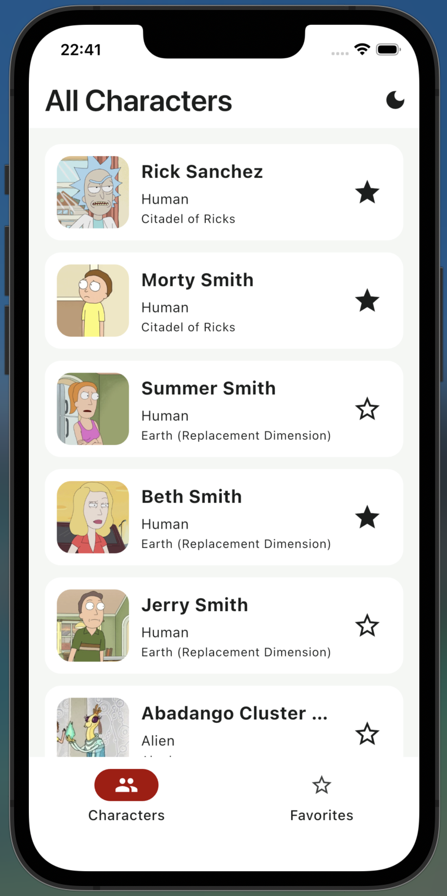
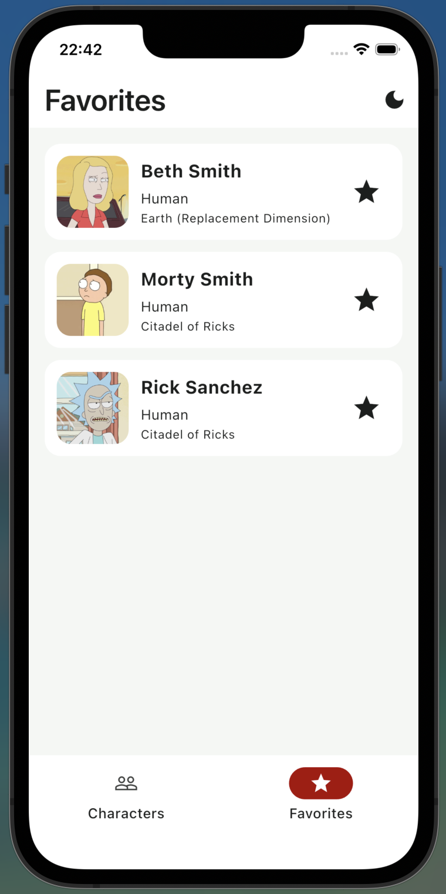
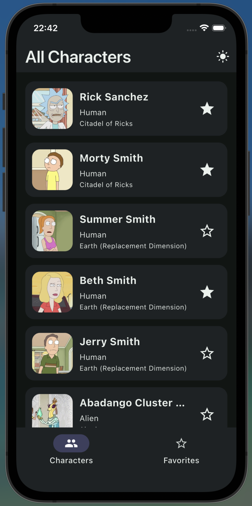
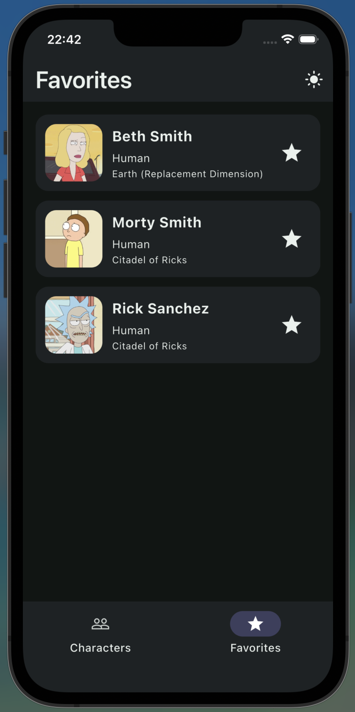

# Rick & Morty Explorer

Мобильное приложение на Flutter для просмотра персонажей из вселенной Rick and Morty.

Приложение загружает персонажей с публичного API, поддерживает пагинацию, добавление в избранное, локальное сохранение избранного, кэширование данных для офлайн-режима и переключение светлой/тёмной темы.

API: [Rick and Morty API](https://rickandmortyapi.com/documentation/)

## Возможности

- Список персонажей в виде карточек
- Пагинация при скролле
- Добавление и удаление персонажей из избранного
- Сортировка избранного по имени
- Кэширование персонажей через Hive
- Оффлайн-доступ к уже загруженным данным
- Переключение светлой и тёмной темы с локальным сохранением

## Скриншоты

### Светлая тема

<table>
  <tr>
    <td align="center"><b>Characters</b></td>
    <td align="center"><b>Favorites</b></td>
  </tr>
  <tr>
    <td></td>
    <td></td>
  </tr>
</table>

### Тёмная тема

<table>
  <tr>
    <td align="center"><b>Characters</b></td>
    <td align="center"><b>Favorites</b></td>
  </tr>
  <tr>
    <td></td>
    <td></td>
  </tr>
</table>

## Сборка и запуск

### Требования

- Flutter `3.41.0`
- Dart `3.11.0`

### Установка зависимостей

```bash
flutter pub get
```

### Запуск приложения

```bash
flutter run
```

### Сборка release-версии

```bash
flutter build apk
```

Для iOS:

```bash
flutter build ios
```

## Версии и зависимости

### Flutter SDK

- Flutter `3.41.0`
- Dart `3.11.0`
- DevTools `2.54.1`

### Основные зависимости

- `flutter_bloc: ^9.1.1`
- `dio: ^5.9.2`
- `hive: ^2.2.3`
- `hive_flutter: ^1.1.0`
- `cached_network_image: ^3.4.1`
- `equatable: ^2.0.8`
- `json_annotation: ^4.11.0`
- `freezed_annotation: ^3.1.0`

### Dev dependencies

- `build_runner: ^2.12.2`
- `json_serializable: ^6.13.0`
- `freezed: ^3.2.5`
- `flutter_lints: ^6.0.0`
